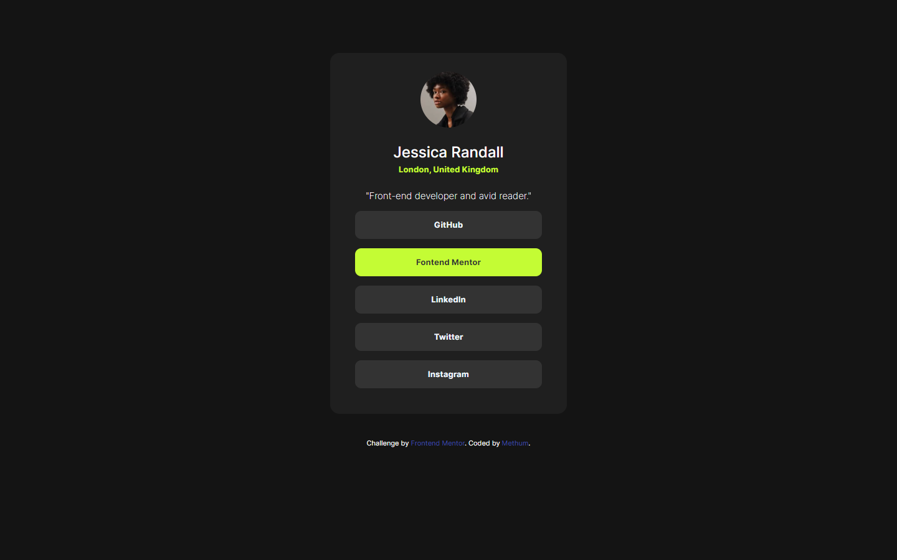

# Frontend Mentor - Social links profile solution

This is a solution to the [Social links profile challenge on Frontend Mentor](https://www.frontendmentor.io/challenges/social-links-profile-UG32l9m6dQ). Frontend Mentor challenges help you improve your coding skills by building realistic projects.

[Screenshot](./Screenshot.png)

## Table of contents

- [Overview](#overview)
  - [The challenge](#the-challenge)
  - [Screenshot](#screenshot)
  - [Links](#links)
- [My process](#my-process)
  - [Built with](#built-with)
  - [What I learned](#what-i-learned)
  - [Continued development](#continued-development)
  - [Useful resources](#useful-resources)
- [Author](#author)
- [Acknowledgments](#acknowledgments)

## Overview

### The challenge

Users should be able to:

- See hover and focus states for all interactive elements on the page

### Screenshot

### Links

- Solution URL: [Add solution URL here](https://github.com/The-OG-Methum/Social-links-profile)
- Live Site URL: [Add live site URL here](https://sociallinks-profile.netlify.app)

## My process
I initiated the project by carefully reviewing the provided readme notes to gain a comprehensive understanding of the requirements. To ensure visual consistency and aesthetic appeal, I proceeded to install the specified fonts tailored for this project.

Next, I focused on structuring the project. Initially, I conceptualized the layout in my mind, carefully considering design principles and user experience. Subsequently, I meticulously translated this conceptualization into a tangible structure, aligning it with the design specifications provided in the accompanying images
### Built with

- Semantic HTML5 markup
- CSS custom properties
- Flexbox
- CSS Grid

### What I learned

This project provided a valuable opportunity for learning and growth, particularly in refining my understanding of CSS pseudo-classes. The challenges encountered and overcome during this endeavor have served as a catalyst for inspiration, prompting me to embark on the creation of my own portfolio. Reflecting on the experience, I find that it has not only expanded my technical skills but has also fueled a newfound enthusiasm for personal projects and professional development.

### Continued development

I'm currently focusing on:

- Improving my JavaScript skills
- Learning more about Angular and front-end frameworks
- Exploring advanced CSS techniques

### Useful resources

- [MDN Web Docs](https://developer.mozilla.org/en-US/docs/Web) - Comprehensive web documentation
- [CSS-Tricks](https://css-tricks.com/) - Tips, Tricks, and Techniques for Web Design
- [Frontend Mentor Community](https://www.frontendmentor.io/community) - Engaging with the community for feedback and learning

## Author

- [Methum](https://github.com/The-OG-Methum)
- Frontend Mentor - [@yourusername](https://www.frontendmentor.io/profile/The-OG-Methum)

## Acknowledgments

I'd like to express my gratitude to those who contributed to the success of this project. Whether it was collaboration, inspiration, or guidance, their support played a significant role.

